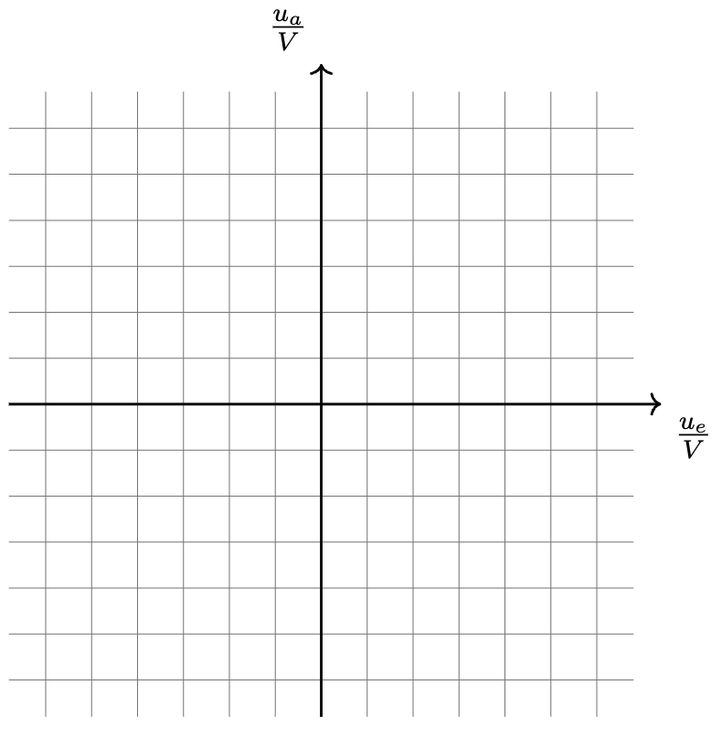

# schaltungstheorie_exercise_template

##### Table of Contents
1. [Introduction](#introduction)
2. [Disclaimer](#disclaimer)
3. [How to use this repo](#how-to-use-this-repo)
4. [LaTeX101 - Crash Course](#latex101---crash-course)
    - [What is LaTeX](#what-is-latex)
    - [How to change headers and footers](#how-to-change-headers-and-footers)
    - [How to change Problem (Aufgabe) title](#how-to-change-problem-aufgabe-title)
    - [How to include your circuit picture](#how-to-include-your-circuit-picture)
    - [How to add questions and style your text](#how-to-add-questions-and-style-your-text)
    - [How to add equations, Matrices, vectors and assign value to variables](#how-to-add-equations-matrices-vectors-and-assign-value-to-variables)
    - [How to include a table](#how-to-include-a-table)
    - [How to include a blank grid for drawing graph](#how-to-include-a-blank-grid-for-drawing-graph)
5. [Closing & My message to you](#closing--my-message-to-you)
6. [Acknowledgement](#acknowledgement)
7. [License](#license)


## Introduction
Hi, my name is Danit Niwattananan and I was a Schaltungstheorie tutor at Technical University of Munich (TUM) back in Winter semester 2022/23. Through out my tenure as tutor, I have helped more than 70-80 first-year Elektro- und Informationstechnik (EI) students both in my regular classes, and the "Wiederholungskurs" for those who failed the GOP first time as well. But as I moved on to specialize in AI and ML, I trust you, the next generations of tutors for Schaltungstheorie, to carry on helping the EI students pass the hardest first-year exam (in my opinion) :). And since I would like to help you create your own beautiful exercise sheets, I have decided to create this repo.

This repo contains a LaTeX source code to my "dummy" exercise sheet that I created for my tutorials as a template. I also attached the rendered PDF here for reference. If you already know something about LaTeX, feel free to copy the source code and use it to create your own exercise sheets however you want. For those who don't have much, or any experience, I will give you quick crash course through this README, just enough so that you can use my template to create your own exercise sheet as well.

Without further ado, let's get started.

## Disclaimer
> This  is NOT a real exercise sheet and does not contain exercises from other tutors. You should make adjustment accordingly and double-check before you upload it to Moodle for hundreds to see. I assume no liability for the accuracy, completeness, and correctness of the content. Refer to [License](#license) for more.

If you notice any errors that are significant or you wants to contribute to this guide, please create an issue on Github and I will get back to you.

## How to use this repo
First , you need to find a text editor that fits you. Personally, I have been using [Overleaf](https://de.overleaf.com/). It requires no installation on your laptop, have a lot of supporting resources online in case your code doesn't work, and is user-friendly to use. You could also go with VS Code or other text editor or IDE and install LaTeX extension, and install LaTeX package on your computer if you feel like a true Software Developter or Gigachad. The extension will most likely have some GUI that you can click for mathematical symbol or Greek alphabets to quickly generate that in LaTeX for you. Pick your poison.

Then, go ahead and create a project space, in which your source code and other medias required for your sheet (for example, a photo of circuit) will locate in. Think of it like a folder that holds all materials for one exercise sheet.

After that, copy the template source code into your `main.tex` and adjust it however you want. Make changes to the headnotes, exercises themselves, and formatting. If you don't know what the hell these code work and how you can change it, keep reading.

## LaTeX101 - Crash Course
### What is LaTeX
LaTeX is a "document preparation system for high-quality typesetting". It is like a programming language that you can use to write absolutely stunning and professional scientific documents, or any form of publishing. You can write out equations, add graphs in structured manner, and references to your writing autonomously. Comparing to using Microsoft Word, it is much cleaner and organized, but also have a little steep learning curve at the start. Since you will write bachelor's thesis (Bachelorarbeit) eventually, this is a good opportunity to learn the basic.

The code can be structured into blocks. Each block will do different things. In the `main.tex`, you will see:
1) `\usepackage` blocks that import packages (think of it like `import` in python or `include` in C/C++). For example, `\usepackage{tikz}` allows you to draw circuit by typing in some code and `\newcommand*{\rom}[1]{\expandafter\@slowromancap\romannumeral #1@}` allows you to use Roman numerals.
2) `\geometry` block that defines the dimension and the margins of the document
3) the main block between `\begin{document}` and `\end{document}`, which will be where we write our texts and equations, include pictures and tables, and draw graphs. Be aware that anything you write inside this block will be rendered in order of what you also write in the source code, so order matters. One exception is pictures since it may start at different page than what you want them to be, depending on the picture size and space left. You could try to move the figure block around to solve this but I don't think it is a big issue.

Now, let's create your exercise sheet.

### How to change headers and footers
First, you should change the name, date, email address, and semester in the headers. Go to 
```latex
\ihead{Schaltungstheorie Tutorübung WS 2022/23\\ 7.Tutorium am 14.12.2022}
\ohead{Danit Niwattananan\\  dummyemail@tum.de}
\setheadsepline{.5pt}
\cfoot{\pagemark}
```
and change them accordingly. Of course you can also decide by yourself what to include, and what not to. Just be aware that the text in `\ihead` line before `\\` will appear in top left, the one after it in bottom left. Analogously goes with `\ohead` line, but on right side.

The third line then create a line of thickness 0.5 point after the headers, while the fourth one set the footer to just have page number.

### How to change Problem (Aufgabe) title
 Go to 
 ```latex
 \section*{Aufgabe 1: Resistiver Eintor}
 ```
 and just change it. The `*` just tells the computer to not create any numbering to our section. If you don't include that, our title will become `1    Aufgabe 1: Resistiver Eintor`. If you want go on a new page, type `\newpage`


 ### How to include your circuit picture
 There are 2 ways to do this: the easy way, and the hard way. The easy way is to use the pictures from the databank of old tutorial exercise sheets, while the hard way is to draw it yourself from scratch using `tikz` package. Even though the easy way is, well, easier, you can't create your own customized circuit with that. Let's get over both of them.
 > If you are not sure whether you can use exercise from other tutors, best ask them for permission first!

 1. **The easy way** - Of course you could use Paint, Adobe, Lightroom, whatever to cut that picture out. However, since those programs work by importing the PDFs as pixels, you will end up getting a low-quality picture that is very pixelated, or illegible even. So, a better way is to use a vectorized art tool like **_Inkscape_** to extract them. Most of the old exercise sheets are drawn using `tikz` package and are considered vectorized picture. That means, if you zoom in closer to the picture, its sharpness stays intact no matter how hard you zoom in. Here are the detailed steps:
    > This method also works with graphs.
    - First, of course you have to download Inkscape. It is available on Mac, Windows, and Linux. I use Mac so the steps below will be Mac-oriented, but should also be the same in other OS.
    - Open up the Inkscape and go to `File -> Import` to import the old exercise sheet from which you want to get the circuit
    - Tick the `Poppler/Cairo import` to import them in original style (otherwise you will get comic style lines). This option will force the import to be able to take in 1 page at a time, so you must specify the page number correctly and redo it for different circuits on different pages in original document. Then go ahead and click `OK`
    - Delete the parts that you don't want it to end up in your circuit pictures, including texts. Only the picture should remain.
    - Drag a box using your mouse that crops only parts that you want to export together. Go to the right panel, and tick `Export Selected only`.
    - Go to bottom right, select the file format to be `.pdf` (in my experience, it works better than `.png` format. You could also use that though). Then select the destination that you want to save the file and click `Export`
    - Upload that exported file to your workspace on Overleaf project, or put it in same folder as your `main.tex` in case you use other text editor.
    - Add this block of code to the place you want to have your picture and change the file name inside `\includegraphics{...}` to be the same as your file.
        ```latex
        \begin{figure}[ht]
            \centering
            \includegraphics{your_circuit.pdf}
        \end{figure}
        ```
    - And Voila, you should see it when you recompile your `main.tex`. If it fails, you will see a square with the specified file name there instead. In that case, check your file name carefully, and check whether your file exists.
2. **The hard way** - Kudos to you who want to draw it by yourself. I have to warn you that this requires you to draw every single line manually with LaTeX code, so it will take quite a long time. Here are the steps:
    - Add this block of code to the place you want to have your picture (don't forget to add `\usepackage{tikz}` and `\usepackage[european,straightvoltages]{circuitikz}` to your `main.tex` for this to work)
    ```latex
    \begin{figure}[ht]
		\centering
        \begin{circuitikz}
            % your circuit code here
        \end{circuitikz}
    \end{figure}
    ```
    - Change the circuit code inside the `\begin{circuitikz}` and `\end{circuitikz}`. Please refer to the vast resources online for this since it is too long to be written here. However, here are some of the most common elements. Keep in mind that 1 line corresponds to 1 element, or a straight circuit line.
    > Note that the numbers in (... , ...) specify the coordinate at which these elements should be place in (x,y) format. Changing them change the location of the elements, and the arrows.
    ```latex
    % Eintor mit u_F und i_F Pfeil von oben nach unten
    \draw(-4, 3) to [ageneric = $\mathcal{F}$, v> = $u_\mathcal{F}$, i>= $i_\mathcal{F}$, o-o](-4, 0);
    ```
    ```latex
    % Equivalenz, also die 3 Striche aehnlich wie Gleich-Symbol
    \draw(0,0) node{$\equiv$};
    ```
    ```latex
    % Spannungsquelle, Stromgquelle analog mit I
    \draw(0,0) to [V<= $u_0$](0, 3);
    ```
    ```latex
    % Ohm'scher Widerstand
    % "*" bedeutet Schwarzer Knoten am Ende, "o" ist weiße. Keine Eingabe bedeutet kein Knoten
    \draw(0,0) to [R = $R_5$, *-*](0, 3);
    ```
    ```latex
    % Spannungspfeil für Leerlauf
    \draw(3,0) to [open, v<= $u_{\mathcal{F}}$](5,0);
    ```
    ```latex
    % Strompfeil
    \draw(2.5,0) to [short, i>= $i_{\mathcal{F}}$](2,0);
    ```
    ```latex
    % Ideale Diode mit Text D1
    \draw (0,0) to[D, l=$D_1$] (2,0); 
    ```
    ```latex
    % Draht mit schwarzem Knoten einerseit, andererseits keiner
    \draw(1.5,3.5) to [short, -*](1.5, 3);
    
### How to add questions and style your text
Add the block 
```latex
\begin{itemize}
    \item[a)]  Bestimmen Sie .....
    \item[b)]  Zeichnen Sie .....
\end{itemize}
```

You can make the text italicized with:
```latex
\textit{Hinweis: Das ist .....}
```
and bold with:
```latex
\textbf{ACHTUNG! ....}
```
If you need to add some text in between questions, just close the itemize block first with `\end{itemize}` and start a new `itemize` block after your added text.


### How to add equations, Matrices, vectors and assign value to variables
Equations can be written either in line together with the text, or written as a stand alone block that will be centered after your text.

- If you just want **inline equations**, type `$` before and after the equation to render the code in between. For example, if you want to assign $R_1 = \frac{1}{2} \hspace{2pt} \Omega, u_{\mathcal{F}} = 10^2 \hspace{2pt} V$, type:
    ```latex
    $R_1 = \frac{1}{2} \Omega, u_{\mathcal{F}} = 10^2 V$
    ```

The underscore `_` will render ONLY the alphabet after to be under the previous symbol (thus you need `{...}` to subscript multi character word like $u_{diff}$). The `^` means "to the power of". The `\mathcal{}` will give you caligraphic character, which is very fancy character like $\mathcal{F}, \mathcal{M}, \mathcal{H}, \mathcal{X}$ etc.

If you feel that the characters are a bit cramped, you can use `\hspace{2pt}` to add space in between. You can adjust the number to make more or less space as you need. It is a `float` by standard.

- If you want **standalone equation** that takes the center of the paper, use:
    ```latex
    \begin{equation*}
        % your equation here, don't need $ in this case
    \end{equation*}
    ```

- Matrices, for example
$\begin{bmatrix}
    1A & 2A\\
    3A & 4A
\end{bmatrix}$ can be written with:
    ```latex
    \begin{bmatrix}
        1A & 2A\\
        3A & 4A
    \end{bmatrix}
    ```
    Note that the `&` divide the first element from the next, and `\\` means new line. You can use this knowledge to even create 3x3 matrix or higher dimensions. `bmatrix` will give you matrix with an edge. If you want smooth matrix with parenthesis (...), use `pmatrix`

- A vector $\left[ \begin{array}{c}
     u_1 \\ u_2 \end{array} \right]$ can be written with:
    ```latex
    $\left[ \begin{array}{c} u_1 \\ u_2 \end{array} \right]$
     ```
     For a bold character `u` or `i` in case of vector, you can use `\mathbi{u}` and `\mathbi{i}`

- You could also combine everything to do something like this:
$
\begin{equation}
    \begin{bmatrix}
    1A & 2A\\
    3A & 4A
    \end{bmatrix} \mathbf{u} +
    \begin{bmatrix}
    5V & 6V\\
    7V & 8V
    \end{bmatrix}  \mathbf{i} = \textbf{0}
\end{equation}
$
    which is just the code below. Use `*` in `\begin{equation*}` and `\end{equation*}` to remove the numbering. Note that I use `\mathbf` instead of `\mathbi` since it doesn't work here with MARKDOWN file, but it should work inside normal LaTeX. If not, try to import correct package to solve that.
    ```latex
    \begin{equation}
    \begin{bmatrix}
    1A & 2A\\
    3A & 4A
    \end{bmatrix} \mathbf{u} +
    \begin{bmatrix}
    5V & 6V\\
    7V & 8V
    \end{bmatrix}  \mathbf{i} = \textbf{0}
    \end{equation}
    ```

### How to include a table
Let's say you want to create a table of attributes (like spannungsgesteuert, stromgesteuert usw.) like this:
<center>

|  | $\mathcal{F}_1$ | $\mathcal{F}_2$ | $\mathcal{F}_3$ |
| --- | ----------- | ----- | --- |
| spannungsgesteuert |  |  |    |
| stromgesteuert |  |  |    |
| attribute3 |  |  |    |
| attribute4 |  |  |    |

</center>

Use this code:
```latex
 \begin{center}
    \begin{tabular}{ | c | m{.5cm}| m{.51cm} | m{.5cm}| } 
      \hline
      & $\mathcal{F}_1$ & $\mathcal{F}_{2}$ & $\mathcal{F}_{3}$ \\
      \hline
      spannungsgesteuert & & &  \\ 
      \hline
      stromgesteuert & & &  \\ 
      \hline
      attribute3 & & &  \\ 
      \hline
      attribute4 & & &  \\ 
      \hline
    \end{tabular}
\end{center}
```
Note that the `&` seperates the columns and `\\` seperates lines like in case of matrix. The number of `&` must be equal for every line, otherwise your table will not render correctly. You can just leave the space after or before `&` empty if you want an empty cell. For every row you add, you must also add `\hline` following that.


### How to include a blank grid for drawing graph
Let's say you want a grid like this:



You can use this code:
```latex
\begin{figure}[ht]
    \centering
    \begin{tikzpicture}
    \draw[step=0.5cm,gray,very thin] (-3.4,-3.4) grid (3.4,3.4);
    \draw[thick,->] (-3.4,0) -- (3.7,0) node[anchor=north west] {$\frac{u_e}{V}$};
    \draw[thick,->] (0,-3.4) -- (0,3.7) node[anchor=south east] {$\frac{u_a}{V}$};
    \end{tikzpicture}
\end{figure}
```

The first `\draw` line indicates the grid to be drawn from (x, y) = (-3.4, 3.4) to (3.4, 3.4) with increment space of 0.5. The reason why it is 3.4 and not 3.5 because that will generate another grid line exactly at the edge. If you wants more columns or more rows of the grid, just increase the numbers.

The next line draws arrow on horizontal direction from (x,y) = (-3.4, 0) to (3.7, 0) which is a bit longer than the grid itself. It then annotates the axis to be $\frac{u_e}{V}$. This is analogous with the next line with horizontal axis.

## Closing & My message to you
That was pretty much it. Now you can create most of the exercise sheets that you desire! Don't feel afraid to Google stuff when some error comes up or when you don't know how to do it. That is how we grow (and how software engineers code lol). You could also use Github Copilot. It is free for students and much, much better than ChatGPT at coding questions.

>**Please star this repository if you find this helpful (in the right top corner). That would be much appreciated!**

If this will be your first time, I warn you that the first tutorial is going to decide if the students will attend your classes or not, so prepare well, and upload the Formelsammlung and exercise sheets in well-time manner (at least 1 week before your class). There is nothing more demotivating than poor preparation that leads to nobody attending your class. Anxiety is normal, but it will be gone after 2-3 classes. I wish best of luck to all of you and have fun tutoring others :)

## Acknowledgement
Thank you Yichen Zhang (@NoMoreNameToUse) for his help with setting up formatting and various LaTeX suggestions. 

## License
This guide and source code is released under the [MIT](LICENSE) License.
